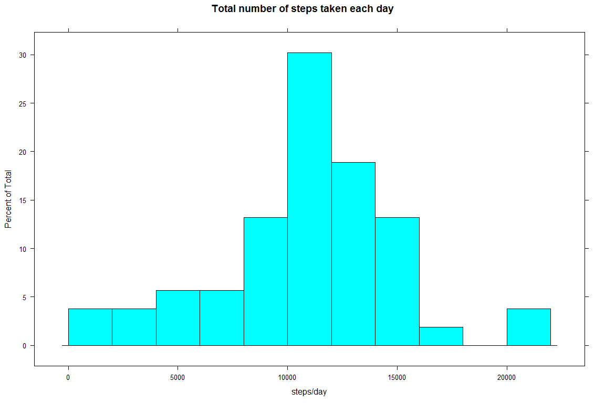
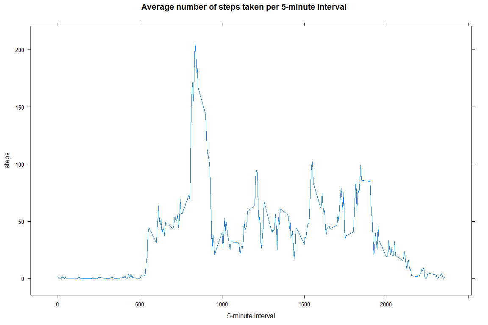
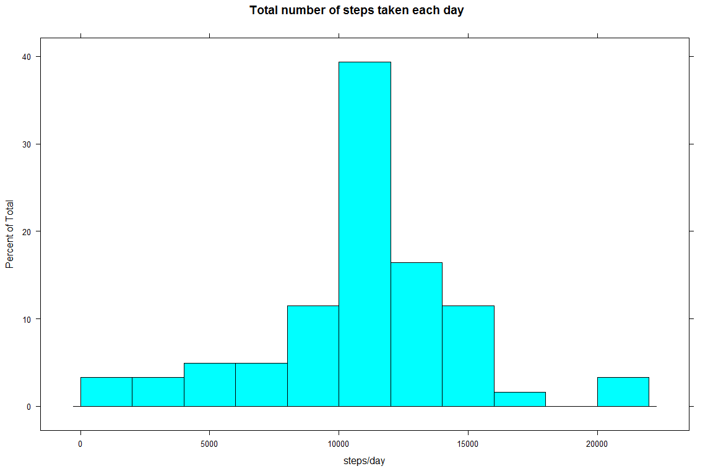
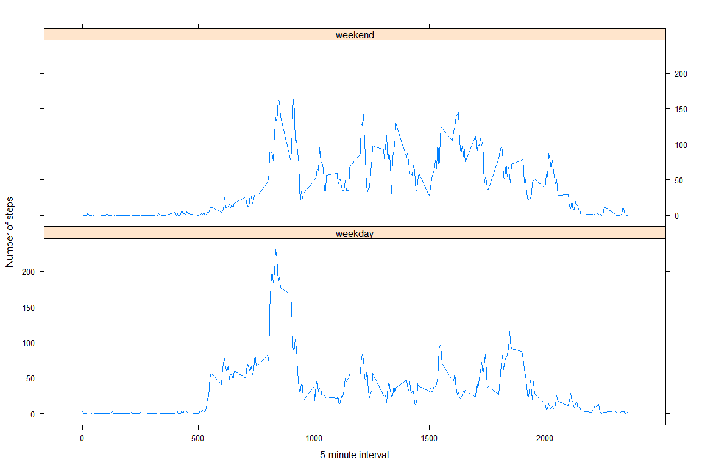

# Reproducible Research: Peer Assessment 1
Panos Rontogiannis  
`r Sys.Date()`  


```r
knitr::opts_chunk$set(fig.width=12, fig.height=8, fig.path='figure/', warning = FALSE)
# The plots will be made using lattice.
library(lattice) 
```

## Loading and preprocessing the data

```r
unzip('activity.zip')
act <- read.csv('activity.csv')
```

## What is mean total number of steps taken per day?

```r
day_sum <- aggregate(steps ~ date, data = act, FUN = sum)

histogram(day_sum$steps, xlab = 'steps/day', main = 'Total number of steps taken each day', breaks = 15)
```

 

```r
mean_steps_per_day <- mean(day_sum$steps, na.rm = TRUE)
median_steps_per_day <- median(day_sum$steps, na.rm = TRUE)

# Round values using sprintf. Somehow the round function didn't seem to work as i wanted it.
mean_steps_per_day <- sprintf("%.2f", mean_steps_per_day)
```

The **mean** of the total number of steps taken per day is 10766.19.  
The **median** of the total number of steps taken per day is 10765.

## What is the average daily activity pattern?

```r
interval_mean <- aggregate(steps ~ interval, data = act, FUN = mean)

xyplot(steps ~ interval, data = interval_mean, type = 'l', main = 'Average number of steps taken per 5-minute interval', xlab = '5-minute interval')
```

 

```r
max_interval <- which.max(interval_mean$steps)
```

The 5-minute interval, on average across all the days in the dataset, containing the maximum number of steps is interval **104**.

## Imputing missing values


```r
total_incomplete_rows <- length(which(!complete.cases(act)))
```

The total number of missing values in the dataset is **2304**.

To fill in the missing steps we use the mean for that 5-minute interval (one of the suggested strategies mentioned in the assignment description).


```r
act_filled <- act

# I'm pretty sure this can be done in a functional style but haven't figured it out yet. Hence the for loop.
for (i in 1:nrow(act_filled)) {
    if (is.na(act_filled$steps[i])) {
        act_filled$steps[i] <- interval_mean$steps[interval_mean$interval == act_filled$interval[i]]
    }
}

day_sum_filled <- aggregate(steps ~ date, data = act_filled, FUN = sum)

histogram(day_sum_filled$steps, xlab = 'steps/day', main = 'Total number of steps taken each day', breaks = 15)
```

 

```r
mean_steps_per_day_filled <- mean(day_sum_filled$steps)
median_steps_per_day_filled <- median(day_sum_filled$steps)

# Rounding.
mean_steps_per_day_filled <- sprintf("%.2f", mean_steps_per_day_filled)
median_steps_per_day_filled <- sprintf("%.2f", median_steps_per_day_filled)
```

After filling in the missing values, the **mean** of the total number of steps taken per day becomes 10766.19 (from 10766.19).  
The **median** of the total number of steps taken per day becomes 10766.19 (from 10765).

We can see that the mean has not changed but that the median has converged with the mean. They are now the same.

## Are there differences in activity patterns between weekdays and weekends?


```r
# Add a column with the date in POSIXlt format.
act_filled$datePOSIX <- as.POSIXlt(act_filled$date, format = '%Y-%m-%d')
# Add a column with the type of day
act_filled$dayType <- ifelse(strftime(act_filled$datePOSIX, format = '%u') > 5, 1, 0)
# and convert it to a factor.
act_filled$dayType <- factor(act_filled$dayType, levels = c(0, 1), labels = c('weekday', 'weekend'))
```


```r
# Subset according to type of day.
wdays <- subset(act_filled, dayType == "weekday")
wends <- subset(act_filled, dayType == "weekend")

# Calculate the mean steps per interval for each type of day.
wdays_mean <- aggregate(steps ~ interval, data = wdays, FUN = mean)
wends_mean <- aggregate(steps ~ interval, data = wends, FUN = mean)
# Then add the dayType. This is going to be used by xyplot to create the panel plot.
wdays_mean$dayType <- "weekday"
wends_mean$dayType <- "weekend"
# Finally  combine the two data frames into one that contain two means for each interval. One for weekdays and the other for weekends. I'm certain there is a more ellegant way but it works.
combined_mean <- rbind(wends_mean, wdays_mean)

xyplot(steps ~ interval | dayType, data = combined_mean, type='l', layout = c(1, 2), xlab = '5-minute interval', ylab = 'Number of steps')
```

 

